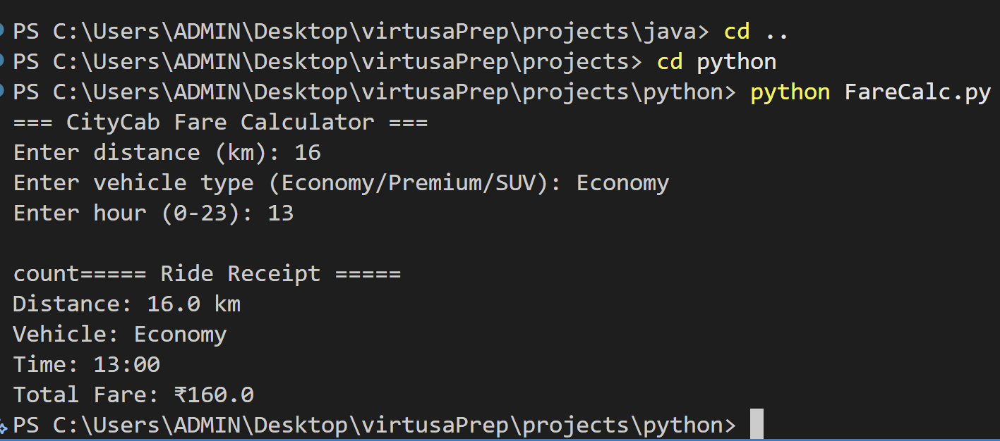
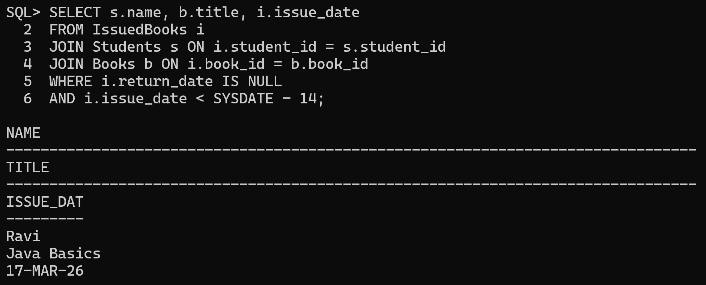
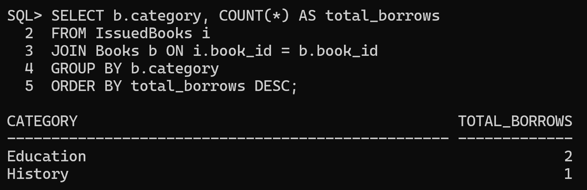
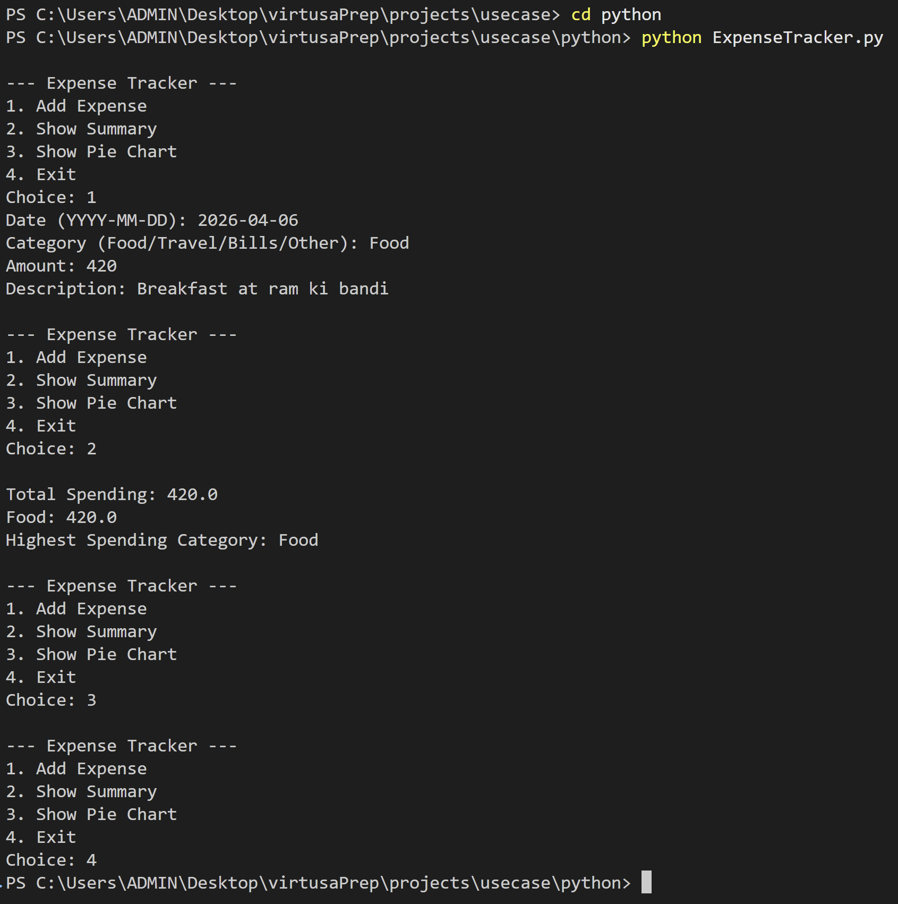
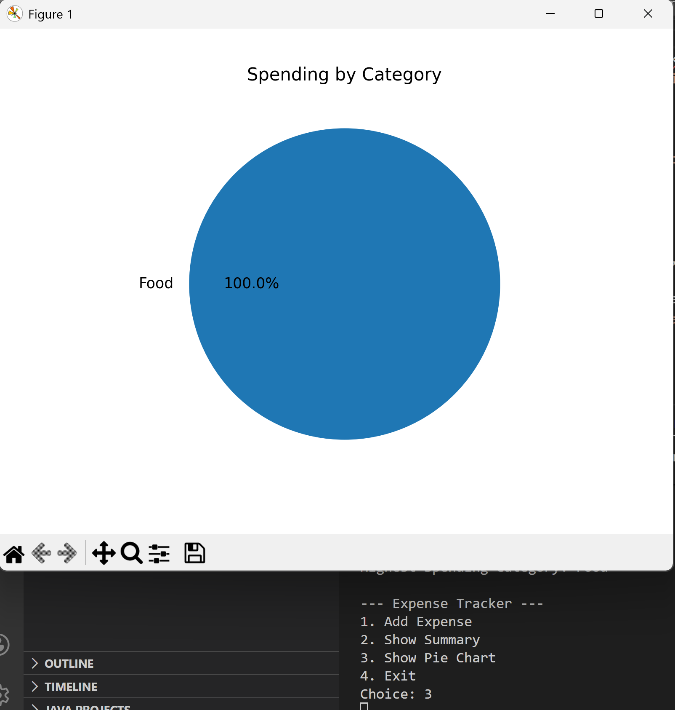
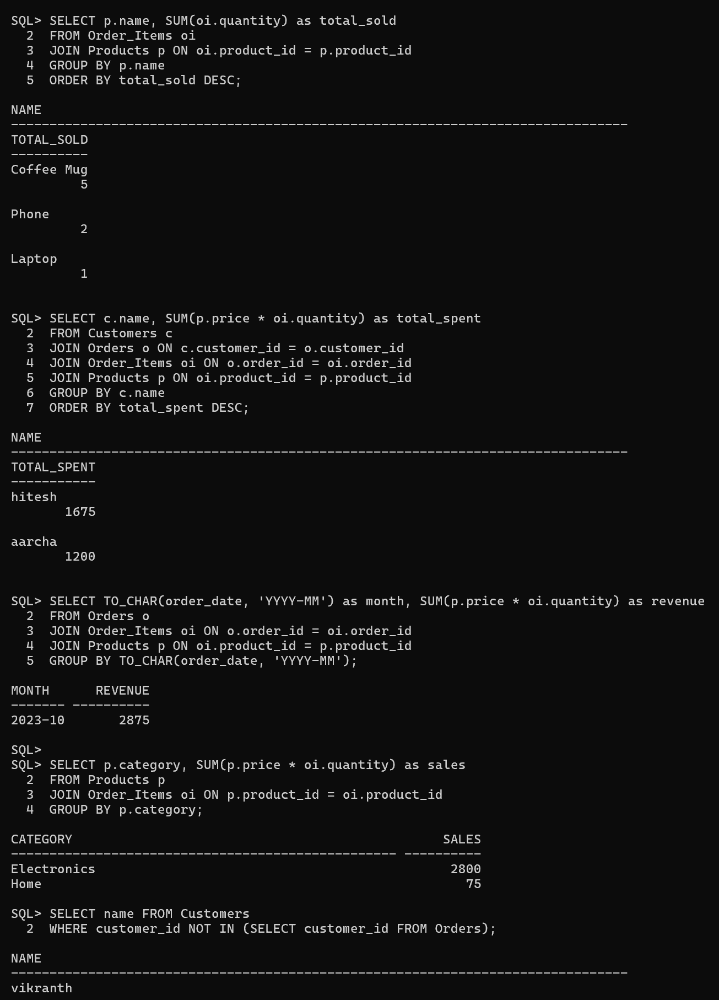
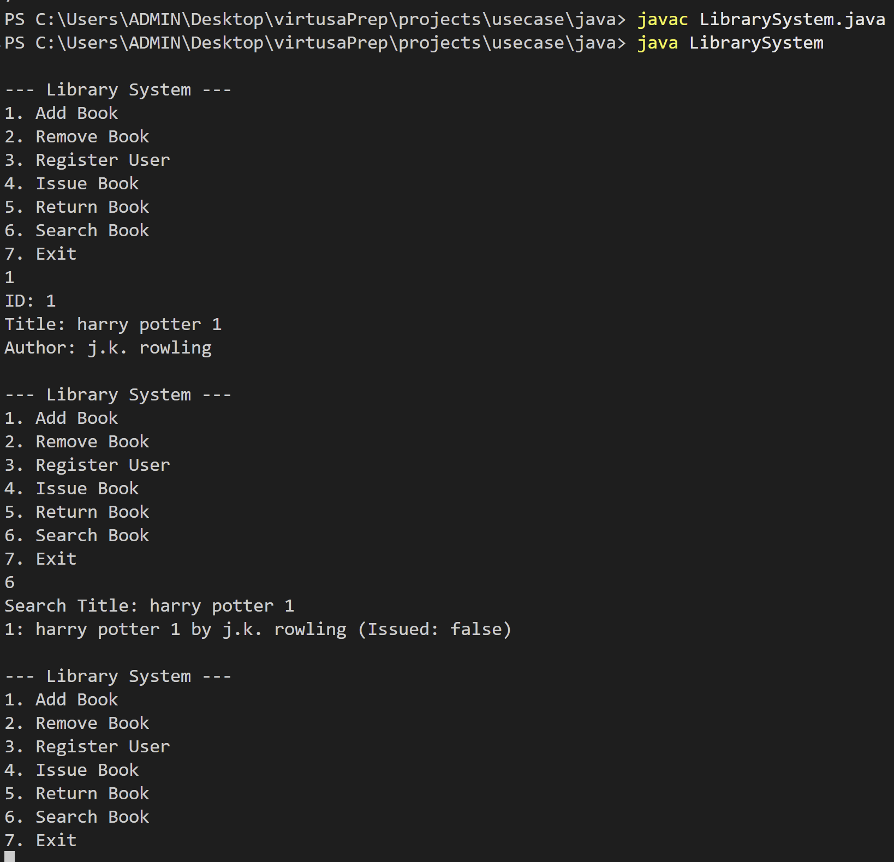
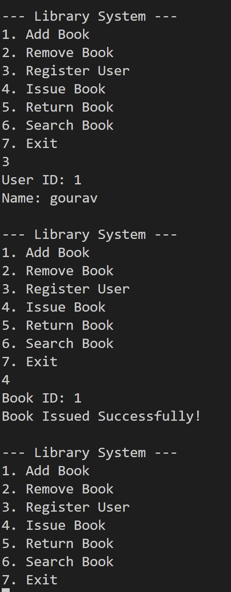
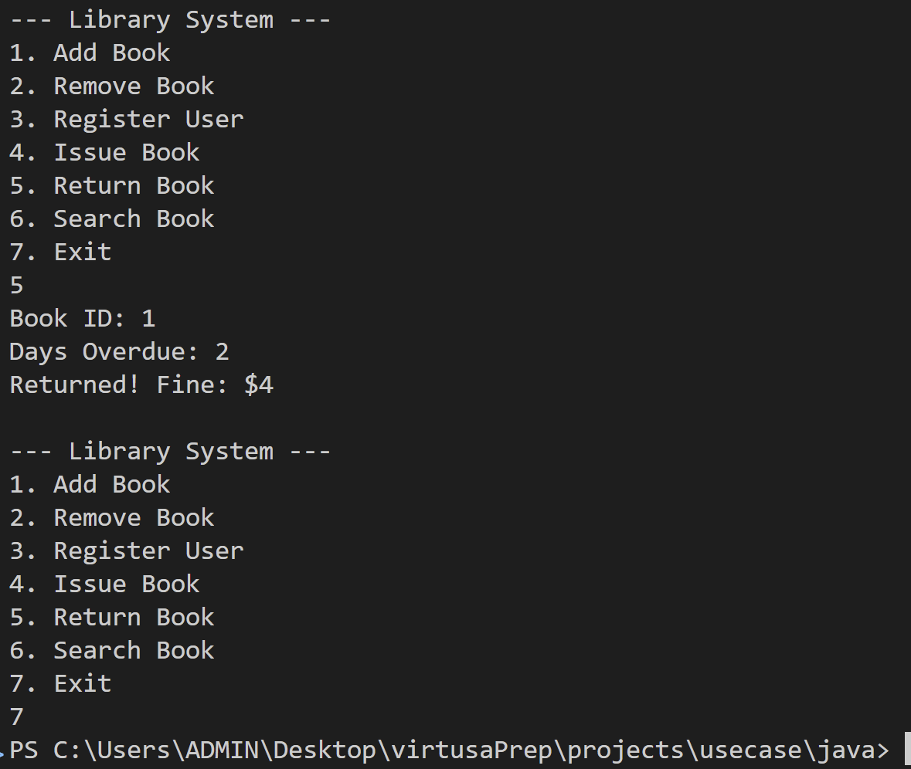

### Virtusa Project

## 📁 Directory Structure

```text
.
├── core/                   # Fundamental logic and validation scripts
│   ├── java/               # Password Validator
│   ├── python/             # Fare Calculator
│   └── sql/                # Library Schema & Overdue Tracking
└── useCase/                # Real-world application scenarios
    ├── java/               # Library Management System (OOP)
    ├── python/             # Smart Expense Tracker (Data Viz)
    └── sql/                # Retail Sales Analysis (Business Intelligence)
```

---

## 🚀 Core Projects

### 1. Java: SafeLog Password Validator
A security utility that enforces password complexity through character analysis.
- **Logic**: Validates minimum length (8+), presence of uppercase letters, and digits.
- **File**: `core/java/PasswordValidator.java`
- **Output**:


### 2. Python: CityCab Fare Calculator
A dynamic pricing engine for ride-hailing services.
- **Logic**: Calculates fares based on distance and vehicle type (Economy/Premium/SUV) with a **1.5x surge** during peak hours (17:00-20:00).
- **File**: `core/python/FareCalc.py`
- **Output**:


### 3. SQL: Library Schema & Maintenance
Relational database design for tracking book circulation and student activity.
- **Logic**: Tracks overdue books (>14 days) and performs cascading deletes for inactive students (3+ years).
- **File**: `core/sql/command.sql`
- **Execution Results**:




---

## 🌟 Use-Case Projects

### 1. Python: Smart Expense Tracker
A tool for logging and visualizing personal spending patterns.
- **Tools**: `json` for persistence, `matplotlib` for data visualization.
- **Logic**: Categorizes expenses, detects highest spending areas, and generates visual breakdowns.
- **File**: `useCase/python/ExpenseTracker.py`
- **Visual Insights**:



### 2. SQL: Online Retail Sales Analysis
queries for an e-commerce environment.
- **Tools**: Joins, Aggregations, Subqueries, Date Formatting.
- **Logic**: Calculates monthly revenue, identifies top-selling products, and detects inactive customers.
- **File**: `useCase/sql/RetailSales.sql`
- **Business Insights**:


### 3. Java: Library Management System
A system for managing library inventory and user transactions.
- **Tools**: OOPs (Classes/Objects), ArrayList, Scanner.
- **Logic**: CRUD operations for books, user registration, and calclating fine for late returns.
- **File**: `useCase/java/LibrarySystem.java`
- **System Workflow**:




---

## 🛠 Tech Stack
- **Java**: Core Java, OOP, Collections Framework.
- **Python**: Matplotlib, JSON handling, CLI logic.
- **SQL**: Oracle-compatible SQL, Relational Algebra, Data Modeling.

## 📜 Credits
The **README.md**  has been designed and developed with the assistance provided by **#Dyad**.

---
*Developed by Gunjari Gourav Kumar*