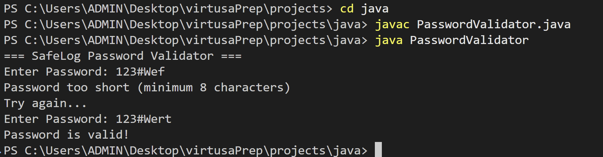
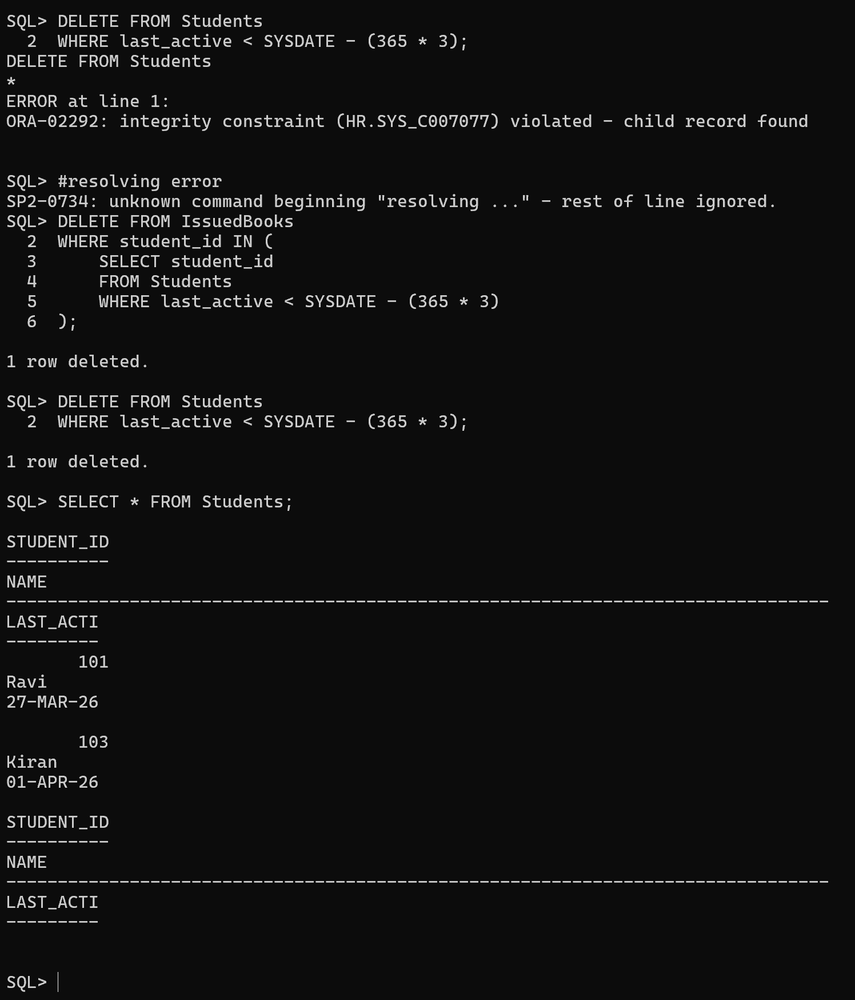

## 🚀 Project Overview

### 1. Java: SafeLog Password Validator
A robust password validation service that ensures user security by enforcing specific complexity requirements.

- **Logic**: Validates that passwords are at least 8 characters long and contain at least one uppercase letter and one digit.
- **File**: `java/PasswordValidator.java`
- **Output Preview**:

---

### 2. Python: CityCab Fare Calculator
A dynamic fare calculation script for a ride-hailing service, accounting for distance, vehicle type, and peak-hour surge pricing.

- **Logic**: 
  - Base rates vary by vehicle type (Economy, Premium, SUV).
  - Applies a **1.5x surge multiplier** during peak hours (17:00 - 20:00).
- **File**: `python/FareCalc.py`
- **Output Preview**:

---

### 3. SQL: Library Management System
An Oracle-compatible database schema and query set for managing book issues, student records, and automated cleanup.

- **Schema**: Includes `Books`, `Students`, and `IssuedBooks` with relational integrity.
- **Key Operations**:
  - Tracking overdue books (issued > 14 days ago).
  - Aggregating borrow counts by category.
  - Cascading cleanup of inactive student records (older than 3 years).
- **Files**: `sql/command.sql`, `sql/outputs.md`
- **Query Results**:

---

## 🛠 Tech Stack & Standards
For detailed development guidelines, frontend architecture, and library usage, please refer to the [AI_RULES.md](./AI_RULES.md) file.

- **Languages**: Java, Python, SQL (Oracle)
- **Frontend (Planned)**: React, TypeScript, Tailwind CSS
- **Icons**: Lucide React